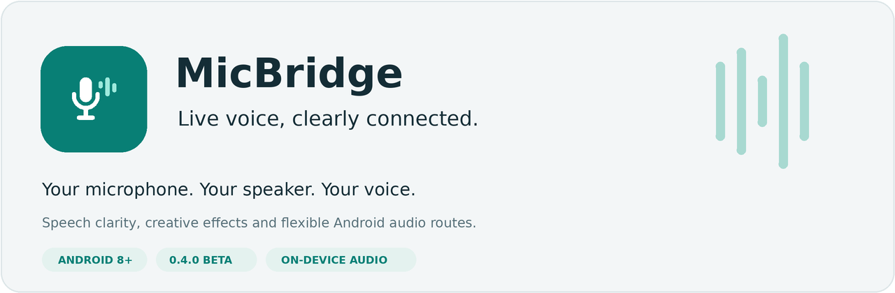

  

  <a href="dist/MicBridge-0.5.0-beta.apk"><strong>Download beta APK</strong></a> ·
  <a href="docs/INSTALLATION.md">Get started</a> ·
  <a href="VOICE_PRESETS.md">Voice presets</a> ·
  <a href="CONTRIBUTING.md">Collaborate</a> ·
  <a href="https://ko-fi.com/jerrychiengct">Support on Ko-fi</a>

# MicBridge

Turn an Android-compatible microphone into a live voice source for your selected speaker. Use the phone's built-in microphone or a connected USB / wired microphone, add speech clarity or creative effects, and send the result to a Bluetooth, wired or USB audio output.

Made for **lectures, presentations and voice experiments** by **Jerry Chieng Chin Tung**.

## Download and start

**[Download MicBridge 0.5.0 beta](dist/MicBridge-0.5.0-beta.apk)** · Android 8.0 or newer · 2 October 2026

Open the APK link, then choose **Download raw file** on GitHub. This repository is public; anyone can browse the source and download the beta APK. This is an installable beta APK; there is no Play Store listing.

1. Install the APK and allow **Microphone** and **Nearby devices** permissions when requested.
2. Connect your microphone, or use **Phone microphone**. Pair your speaker in Android settings and enable **Media audio**.
3. On **Live**, select the input and output. Start with low speaker volume and gain around **1.0×**.
4. Choose **Lecture** in **Studio**, then tap **Start session**. The app checks the actual route while muted.
5. Tap **Calibrate background noise**, stay quiet for 1.5 seconds, then **Unmute**.

Keep MicBridge visible during playback. [Full installation guide and troubleshooting →](docs/INSTALLATION.md)

## What you can do

| Feature | What it gives you |
| --- | --- |
| Flexible microphone input | Built-in, Android-compatible USB and wired microphones; mono/stereo format negotiation |
| Choose your output | Generic Bluetooth speakers, named brands, wired / USB audio and the phone speaker |
| Speech voice care | Gentle noise reduction, microphone noise-floor calibration, bounded level assist and de-essing |
| Shape your sound | Independent bass, mid and treble, warm/bright tone, pitch, grit, robot texture and echo |
| 16 original presets | Lecture, Studio Speech, Broadcast, Warm Narrator, Vigilante and more |
| Latency controls | Approximately 5 ms processing blocks in Fast mode, smaller requested buffers and underrun recovery |
| Live monitoring | Input-level history, clipping indication, actual-route checks, persistent Mute and Stop controls |
| Local processing | No microphone recordings, cloud processing, advertising or analytics |

## Refined interface in 0.5.0

A quieter charcoal and mint palette, large page titles, soft grouped cards and original outline icons give the native Android app an iOS-inspired visual style. Studio offers four quick presets, the full 16-preset collection and expandable creative controls. Device labels wrap, controls scale with text, and each tab remembers its scroll position.

*Design reference, not an Android screenshot. Actual layout and system controls vary by device and font settings.* [Design notes](docs/DESIGN.md)

## Inside the app

| Tab | Purpose |
| --- | --- |
| **Live** | Select microphone and speaker, monitor input, calibrate noise and manage playback |
| **Studio** | Pick a preset, adjust EQ and effects, or bypass processing |
| **Speakers** | Read generic Bluetooth instructions and browse examples from 12 brands |
| **About** | Find creator details, GitHub and Ko-fi links, and donation / collaboration email buttons |

The Material-style adaptive icon supports Android themed icons. The banner above is a branding graphic, not a device screenshot. Genuine interface screenshots will be added after capture on a phone or emulator; the screenshot instructions are in [Testing](docs/TESTING.md#capture-interface-screenshots).

## Start with the right preset

- **Lecture / Studio Speech:** natural pitch, speech presence, gentle leveling and voice care.
- **Broadcast / Warm Narrator:** warmer spoken delivery.
- **Crisp Presenter / Soft Spoken:** clearer consonants or bounded assistance for a quiet voice.
- **Vigilante / Cyber Pilot / Cinematic:** creative character textures.
- **Natural:** neutral processing; use **Effects bypass** to turn processing off.

All presets are original MicBridge tunings. Commercial preset packs, licensed voice models and paid plug-in engines are not included. [Full preset collection and processing references →](VOICE_PRESETS.md)

## Compatibility and latency

Microphone support depends on what Android and your adapter expose as a working audio input. Speaker support follows the audio connection, with no brand whitelist. Generic names such as **BT Speaker** or **Wireless Speaker** are welcome. [Speaker guide →](SPEAKER_GUIDE.md)

Fast mode requests smaller app buffers; Android can adjust their size. **5 ms is a processing-block duration, not measured microphone-to-speaker latency.** Bluetooth speakers add their own buffering. Wired or USB output is usually the better choice when delay is distracting. Pitch effects add processing delay, and echo adds audible repeats.

Processing can improve levels and clarity, but cannot restore missing detail, repair transmitter clipping or prevent acoustic feedback. Keep the microphone away from the speaker. Hands-free Bluetooth microphones and phone earpieces are excluded from this media-audio engine. Built-in, USB and wired microphones remain available; unsupported combinations stay muted and stop with an error.

## Device-selection cleanup retained from 0.4.2

The input and output selectors now use one Android device snapshot, remove repeated IDs, preserve choices by identity and recheck availability before starting. Disconnecting a selected device clears that choice instead of selecting a replacement. Distinct same-name ports are numbered; Bluetooth media and LE Audio profiles remain separately labelled. Only supported route categories appear. Long labels wrap and the main controls adapt to larger text.

## Beta status

| Check | Current status |
| --- | --- |
| Android SDK 35 compilation / APK signature | Verified for 0.5.0 |
| Digital audio and format-negotiation tests | Passed; scope documented in [Testing](docs/TESTING.md) |
| Upgrade signing | Same test certificate as earlier supplied betas |
| Physical microphone / speaker combinations | Awaiting documented hardware test results |
| End-to-end acoustic latency | Not yet measured on a physical setup |
| Foreground operation | App must remain visible; leaving the screen stops the session |

[Release checklist](docs/RELEASE_CHECKLIST.md) · [Changelog](CHANGELOG.md) · [Build instructions](docs/BUILDING.md) · [Audio engine](docs/AUDIO_ENGINE.md)

## Support and collaboration

Created by **[Jerry Chieng Chin Tung](https://github.com/jerrychiengct)**. Android developers, audio engineers, designers and beta testers are welcome.

- **Collaborate:** read [Contributing](CONTRIBUTING.md), then share an idea, improvement or hardware test report.
- **Report a problem:** use the repository's [issue forms](https://github.com/jerrychiengct/micbridge-android/issues/new/choose) to report a bug or share a hardware test.
- **Support on Ko-fi:** [ko-fi.com/jerrychiengct](https://ko-fi.com/jerrychiengct). Support is voluntary and opens an external service.
- **Donate or contact Jerry:** email **[jerrychiengchintung@gmail.com](mailto:jerrychiengchintung@gmail.com?subject=MicBridge%20project%20support)** personally. Donations are voluntary; MicBridge does not collect payments.
- **Follow other projects:** visit [Jerry's public GitHub profile](https://github.com/jerrychiengct). MicBridge is a public beta project.

[Support details](SUPPORT.md) · [Privacy](PRIVACY.md)
