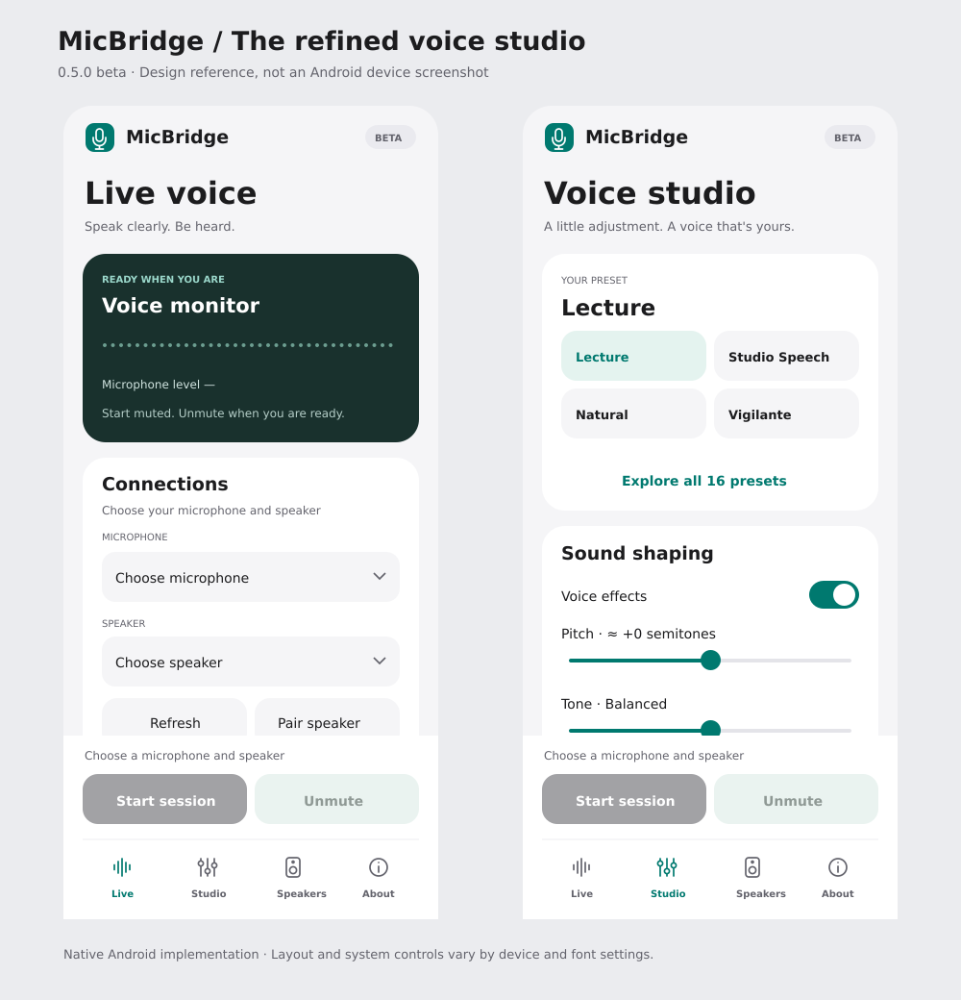

# Interface design — 0.5.0

MicBridge uses an iOS-inspired visual hierarchy within a native Android app: restrained colour, spacious grouped surfaces, clear titles and a quiet navigation bar. It uses Android fonts and controls with original outline icons.

## Main choices

- **Colour:** warm neutral background, white cards, charcoal primary action and mint/teal accent. Live monitoring has a dark green surface.
- **Hierarchy:** app identity stays small; each tab has a large page title. Active session state appears above the real microphone level history.
- **Controls:** Start/Stop and Mute remain anchored above navigation. Device selectors have wrapping text and an explicit dropdown chevron. Missing devices retain the unselected prompt.
- **Studio:** Lecture, Studio Speech, Natural and Vigilante have quick buttons. The picker contains all 16 original presets. Sound shaping, EQ and voice care have separate cards. Creative controls expand on request or for a creative preset.
- **Details:** routing and latency explanations open on demand; live buffer diagnostics remain available in Session tuning.
- **Access:** text scales with system settings, buttons have minimum touch sizes, tab selection is exposed to accessibility, and sliders announce their current values. The UI does not add continuous animation. Each tab retains its scroll position while the activity is open.

## Visual reference

This is a code-authored SVG design reference, not an Android capture. It shows illustrative initial states; no real hardware or live audio is depicted. System insets, type metrics, dialogs and switches vary by Android version. The actual APK must be reviewed on a phone for narrow screens, landscape, large fonts and TalkBack before production release.

The original SVG is [available here](assets/ui-design-0.5.0.svg). Genuine device screenshots will be added under the [testing workflow](TESTING.md#capture-interface-screenshots).
